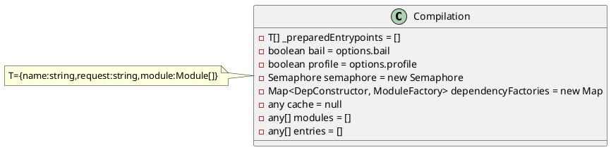
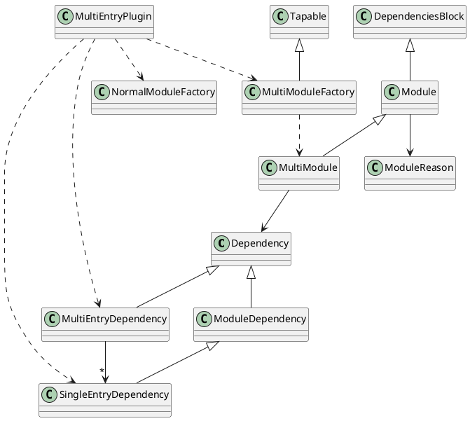

# webpack流程以及插件分析
* `XXXX：`广播make事件之后，执行SingleEntryPlugin监听器，开始执行compilation的代码


```js
    /*
        compilation[MultiEntryPlugin]：存储在compilation.dependencyFactory
            将MultiEntryDependency和multiModuleFactory = new MultiModuleFactory()关联起来
            将SingleEntryDependency和normalModuleFactory(传入)关联起来

        compilation[SingleEntryPlugin]：update compilation.dependencyFactory
            将SingleEntryDependency和normalModuleFactory关联起来
    */
    /* 
        make[MultiEntryPlugin]：
            通过MultileEntryPlugin.createDependency(entry: string, name: string)建立起入口文件的依赖实例dep: MultiEntryDependency
            调用compilation.addEntry(context, MultiEntryDependency dep, name, callback)
        
        make[SingleEntryPlugin]：
            通过SingleEntryPlugin.createDependency(entry, name)建立依赖对象dep:SingleEntryDependency
            调用compilation.addEntry(context, MultiEntryDependency dep, name, callback)
    */
    /*
        context: context  /Users/wangfanghua618/Documents/webapp
        entry: Dependency   MultiEntryDependency={dependencies:[SingleEntryDependency], name: "main", optional: false, weak: false, type: 'multi entry'}
        name: 'main'
        callback:

        function addEntry(context, entry, name, callback) {
            1、广播addEntry事件this.hooks.addEntry.call(entry, name)，监听器为空[]
            2、入口存入compilation._preparedEntrypoints = []，已存在则覆盖
            3、调用this._addModuleChain(context, entry, module => {this.entries.push(module)}, (err, module) => { ... })
        }
    */
    /*
        context: string /Users/wangfanghua618/Documents/webapp
        dependency: Dependency(入口文件依赖实例){dependencies:[SingleEntryDependency], name: "main", optional: false, weak: false,type: 'multi entry'}
        onModule: module => this.entries.push(module)
        callback: 
        功能：通过依赖获取对应的ModuleFactory，并通过ModalFactory创建对应的Module

        function _addModuleChain(context, dependency, onModule, callback2) {
            1、根据dependency.constructor=MultiEntryDependency从compilation.dependencyFactories获取moduleFactory=MultiModuleFactory
            2、调用semaphore.acquire(callback3)
            3、执行callback3()，执行moduleFactory.create(TData data, callback4)
                data = {
                    context: "/Users/wangfanghua618/Documents/webapp",
                    contextInfo: {
                        compiler: undefined,
                        issuer: ''
                    },
                    dependencies: [MultiEntryDependency]
                }
                3-1: MultiModule.prototype.create(data, callback4)，生成MultiModule实例，执行callback4
            4、回到callback3执行callback4
                err: null
                module: MultiModule, {context, dependencies: [SingleEntryDependency], type: "javascript/dynamic"}
                执行compilation.addModule(module)
                4-1:功能：1、将Module存入到Map<identifier, Module>_modules中；2、将module存入到modules中；3、返回AddModuleResult={module, issuer: true, build: true, dependencies: true}，标识模块是否已经built，有issuer，有dependencies
                返回到callback4
            5、执行compilation.buildModule(module, optional, origin, dependencies, thisCallback)
                5-1: 执行module.build(options, compilation, resolver, fs, callback5)，MultiModule.build初始化一些信息，返回执行callback5
                5-2: 执行callback5(error)：处理当前模块的依赖
            6、执行afterBuild(): 执行compilation.processModuleDependencies(module, callback6)
            7、在compilation.processModuleDependencies(module, callback6)中调用compilation.addModuleDependencies(module, dependencies, bail, cacheGroup, recursive, callback)
        }
    */  
```
```js
    /* 
        NormalModuleFactory的构建过程：
        TData = {
            contextInfo: {
                issuer: string
                compiler: string
            },
            context: string,
            dependencies: Dependency[]
        }
        data = {
            contextInfo: {
                issuer: 'XXX',
                compiler: 'compilerName'
            },
            context: options.context,
            dependencies: [SingleEntryDependency]
        }
        normalModuleFactory.create(TData data, callback)
        1、获取上下文
        2、广播normalModuleFactory.beforeResolve，监听器为[]，直接执行callback
            param = {
                contextInfo,
                resolveOptions,
                context,
                request,
                dependencies
            }
            // result = param
            callback(err, result) {
                3、广播normalModuleFactory.factory，获取factory
                4、执行factory(result, callback2(err, module))
                    4-1: 执行normalModuleFactory.resolver获取resolver，执行resolver(result, callback3(err, data))
                        4-1-1: 从result获取上下文，contextInfo、context、request
                        4-1-2: 获取loaderResolver
            }
    */ 
```
* 版本号：4.29.6
```js
    function webpack(options, callback) {
        /** 
        * 1、校验并处理options
        * 三方库ajv、ajv-keywords
        * ajv：JSON Schema验证工具
        */ 
        const webpackOptionsValidationErrors = validateSchema(
		    webpackOptionsSchema,
		    options
	    );
	    if (webpackOptionsValidationErrors.length) {
		    throw new WebpackOptionsValidationError(webpackOptionsValidationErrors);
	    }
        /**
        * 2、生成compiler实例
        */ 
	    let compiler;
	    if (Array.isArray(options)) {
		    compiler = new MultiCompiler(options.map(options => webpack(options)));
	    } else if (typeof options === "object") {
            // 2-1：初始化config，将用户的options和默认config合并
		    options = new WebpackOptionsDefaulter().process(options);
            // 2-2：生成compiler
		    compiler = new Compiler(options.context);
		    compiler.options = options;
            // 2-3：
		    new NodeEnvironmentPlugin().apply(compiler);
            // 2-4：执行注册options.plugins，注册监听器
		    if (options.plugins && Array.isArray(options.plugins)) {
			    for (const plugin of options.plugins) {
				    if (typeof plugin === "function") {
					    plugin.call(compiler, compiler);
				    } else {
					    plugin.apply(compiler);
				    }
			    }
		    }
            // 2-5：广播environment、afterEnvironment
		    compiler.hooks.environment.call();//实际debug，没有监听器
		    compiler.hooks.afterEnvironment.call();//实际debug，没有监听器
            // 2-6：执行内部插件，注册监听器
		    compiler.options = new WebpackOptionsApply().process(options, compiler);
	    } else {
		    throw new Error("Invalid argument: options");
	    }
        /**
        * 3、执行compiler.run或watch
        */ 
	    if (callback) {
		    if (typeof callback !== "function") {
			    throw new Error("Invalid argument: callback");
		    }
		    if (
			    options.watch === true ||
			    (Array.isArray(options) && options.some(o => o.watch))
		    ) {
			    const watchOptions = Array.isArray(options)
				    ? options.map(o => o.watchOptions || {})
				    : options.watchOptions || {};
			    return compiler.watch(watchOptions, callback);
		    }
		    compiler.run(callback);
	    }
	    return compiler;
    }
```
# 生成copmiler
* `2-1处理options：`1、生成默认config；2、将用户options合并到config
```js
    options = new WebpackOptionsDefaulter().process(options);
    /**
    * OptionsDefaulter
    *     ************ 类**************      
    *           OptionsDefaulter       
    *     ************ 属性************
    *       this.defaults = {}         
    *       this.config = {}            
    *     ************ 操作 ***********
    *       process(options): void
    *       set(name,config,def): void
    *     *****************************
    */ 
    /**
    * WebpackOptionsDefaulter extends OptionsDefaulter
    *     ************ 类**************      
    *        WebpackOptionsDefaulter
    *        在constructor中初始化config的默认值 
    *     ************ 属性************
    *           无
    *     ************ 操作 ***********
    *           无
    *     *****************************
    */ 
    /** options
    * entry: './src'
    * devtool: false
    * cache: false
    * context: process.cwd()
    * target: 'web'
    * module: {rules,defaultRules,}
    * output: {filename,chunkFilename,webassemblyModuleFilename,library,太多了}
    * node: {}
    * performance: {},
    * optimization: {},
    * resolve: {},
    * resolveLoader: {}
    */ 
```
* `2-2生成compiler实例：`从2-1可以知道，options.context是process.cwd()
```js
    compiler = new Compiler(options.context);
	compiler.options = options;
    /**
    * Compiler
    *     ************ 类**************      
    *           Compiler       
    *     ************ 属性************
    *       this.hooks = {}  
    *       this.name = undefined // string,compiler实例名，对比childCompiler
    *       this.parentCompilation = undefined //Compilation,记录mainCompiler生成的compilation实例
    *       this.outputPath = '' //string
    *       this.outputFileSystem = null
    *       this.inputFileSystem = null
    *       this.recordsInputPath = null //string | null
    *       this.recordsOutputPath = null //string | null
    *       this.records = {}
    *       this.removedFiles = new Set() //Map<string, number>
    *       this.fileTimesStamp = new Map() //Map<string, number>
    *       this.contextTimesStamp = new Map()
    *       this.resolverFactory = new ResolverFactory() // ResolverFactory
    *       this.resolvers = {normal,loader,context}
    *       this.options = ({}) // WebpackOptions
    *       this.context = context // process.cwd()
    *       this.requestShortener = new RequestShortener(context)
    *       this.running = false
    *       this.watchMode = false
    *       this._assetEmittingSourceCache = new WeakMap()
    *       this._assetEmittingWritenFiles = new Map()
    *     ************ 操作 ***********
    *       watch(watchOptions, handler): Watching
    *       run(callback): void
    *       runAsChild(callback): void
    *       purgeInputFileSystem(): void
    *       emitAssets(compilation, calback): void
    *       emitRecords(callback): void
    *       readRecords(callback): void
    *       createChildCompiler(compilation,compilerName,compilerIndex,outputOptions,plugins): Compiler
    *       isChild(): boolean
    *       createCompilation(): Compilation
    *       newCompilation(params): Compilation
    *       createNormalModuleFactory(): NormalModuleFactory
    *       createContextModuleFactory(): ContextModuleFactory
    *       newCompilationParams(): any
    *       compile(callback): void
    *     *****************************
    */ 
   this.hooks = {
       shouldEmit: new SyncBailHook(["compilation"])/* 此处参数和监听器参数、触发器参数一样；一般异步hook会增加一个callback参数*/
   }
```
* `2-3执行NodeEnvironmentPlugin插件，初始化compiler系列*FileSystem属性，并为beforeRun事件注册监听器`
```js
     new NodeEnvironmentPlugin().apply(compiler);
    /**
    * NodeEnvironment
    *     ************ 类**************      
    *           NodeEnvironment       
    *     ************ 属性************
    *       无           
    *     ************ 操作 ***********
    *       apply(compiler)
    *     *****************************
    */
   /**
    * NodeOutputFileSystem
    *     ************ 类**************      
    *           NodeOutputFileSystem       
    *     ************ 属性************
    *       this.mkdirp = mkdirp
    *       this.mkdir = fs.mkdir.bind(fs)
    *       this.rmdir = fs.rmdir.bind(fs)
    *       this.unlink = fs.unlink.bind(fs)
    *       this.writeFile = fs.writeFile.bind(fs)
    *       this.join = path.join.bind(path) 
    *       都是node库fs，path，mkdir      
    *     ************ 操作 ***********
    *       无
    *     *****************************
    */ 
   /**
    * NodeWatchFileSystem
    *     ************ 类**************      
    *           NodeWatchFileSystem       
    *     ************ 属性************
    *       this.inputFileSystem = inputFileSystem
    *       this.watcherOptions = {aggregateTimeout: 0}
    *       this.watcher = new Watchpack(this.watcherOptions) 
    *     ************ 操作 ***********
    *       watch(files, dirs, missing, startTime, options, callback, callbackUndelayed): void
    *     *****************************
    */
//      enhanced-resolve三方库：CachedInputFileSystem和NodeJsInputFileSystem
//      watchpack三方库：Watchpack

   function apply(compiler) {
       compiler.inputFileSystem = new CachedInputFileSystem(new NodeJsInputFileSystem(), 60000)
       const inputFileSystem = compiler.inputFileSystem
       compiler.outputFileSystem = new NodeOutputFileSystem()
       compiler.watchFileSystem = new NodeWatchFileSystem(compiler.inputFileSystem)
       compiler.hooks.beforeRun.tap('NodeEnvironmentPlugin', (compiler) => {
           if (compiler.inputFileSystem === inputFileSystem) {
               inputFileSystem.purge();
           }
       })
   }
```
* `2-4执行注册options.plugins，注册监听器：`执行外部插件
* `2-5广播environment、afterEnvironment：`经debug，这两个事件目前都没有监听器
* `2-6执行内部插件，注册监听器`
```js
    compiler.options = new WebpackOptionsApply().process(options, compiler);
    /**
    * WebpackOptionsApply
    *     ************ 类**************      
    *           WebpackOptionsApply       
    *     ************ 属性************
    *       无           
    *     ************ 操作 ***********
    *       process(options, compiler)
    *     *****************************
    */
   function process(options, compiler) {
        //  2-6-1：初始化一部分数据    
        compiler.outputPath = options.outputPath
        compiler.recordsInputPath = options.recordsInputPath || options.recordsPath
        compiler.recordsOutputPath = options.recordsOutputPath || options.recordsPath
        compiler.name = options.name
        compiler.dependencies = options.denpendencies
        // 2-6-2：执行一系列内部插件，并为相关事件注册监听器...
        /**
        * 2-6-3：广播entryOption事件 */ 
        new EntryOptionPlugin().apply(compiler)
        compiler.hooks.entryOption.call(options.context, options.entry)
        // 2-6-4：执行一系列内部插件，并为相关事件注册监听器...
        /**
         * 2-6-5：广播afterPlugins事件
        */
        compiler.hooks.afterPlugins.call(compiler);// 实际debug，没有监听器
        // 2-6-7：compiler.resolverFactory
        // 注册内部内联插件
        // 2-6-8：为compiler.resolverFactory.hooks.resolveOptions注册监听器
        compiler.resolverFactory.hooks.resolveOptions
			.for("normal")
			.tap("WebpackOptionsApply", resolveOptions => {
				return Object.assign(
					{
						fileSystem: compiler.inputFileSystem
					},
					options.resolve,
					resolveOptions
				);
			});
		compiler.resolverFactory.hooks.resolveOptions
			.for("context")
			.tap("WebpackOptionsApply", resolveOptions => {
				return Object.assign(
					{
						fileSystem: compiler.inputFileSystem,
						resolveToContext: true
					},
					options.resolve,
					resolveOptions
				);
			});
		compiler.resolverFactory.hooks.resolveOptions
			.for("loader")
			.tap("WebpackOptionsApply", resolveOptions => {
				return Object.assign(
					{
						fileSystem: compiler.inputFileSystem
					},
					options.resolveLoader,
					resolveOptions
				);
            });
            /**
             * 2-6-9：广播afterResolvers事件
             * NodeSourcePlugin：在WebpackOptionsApply中执行插件，为事件注册监听器
             * AMDPlugin：在WebpackOptionsApply中执行插件，为事件注册监听器
            */
            compiler.hooks.afterResolvers.call(compiler);// 监听器插件：NodeSourcePlugin、AMDPlugin
            return options
   }
```
```js
    /**
    * 2-6-3：广播entryOption事件： SyncBailHook
    * 注册的监听器：vConsolePlugin(微信vConsole提供的插件)，EntryOptionPlugin
    * EntryOptionPlugin：在WebpackOptionsApply中执行，为entryOption事件注册监听器
    * 该插件为entryOption事件注册监听器,监听器返回true
    * 执行：
    *  1、参数context = options.context = process.cwd();entry = options.entry（entry可以是string，array，object，function）
    *  2、如果entry参数是string | array | object，则使用itemToPlugin处理
    *      string：则执行插件SingleEntryPlugin，为compilation和make事件注册监听器
    *      object：则执行为每一项key执行一次SingleEntryPlugin，为compilation和make事件注册监听器
    *      array：则执行MultiEntryPlugin，为compilation和make事件注册监听器
    *  3、如果entry参数function，则执行DynamicEntryPlugin插件，为compilation和make事件注册监听器
    * 作用：
    *   广播entryOptions事件，就是执行SingleEntryPlugin（MultiEntryPlugin、DynamicEntryPlugin），为compiler的compilation和make事件注册监听器
    * */
   /**
    * EntryOptionPlugin
    *     ************ 类**************      
    *           EntryOptionPlugin       
    *     ************ 属性************
    *       无 
    *     ************ 操作 ***********
    *       apply(compiler): void
    *     *****************************
    */
   apply(compiler) {
		compiler.hooks.entryOption.tap("EntryOptionPlugin", (context, entry) => {
			if (typeof entry === "string" || Array.isArray(entry)) {
				itemToPlugin(context, entry, "main").apply(compiler);
			} else if (typeof entry === "object") {
				for (const name of Object.keys(entry)) {
					itemToPlugin(context, entry[name], name).apply(compiler);
				}
			} else if (typeof entry === "function") {
				new DynamicEntryPlugin(context, entry).apply(compiler);
			}
			return true;
		});
    }
     /**
    * SingleEntryPlugin
    *     ************ 类**************      
    *           SingleEntryPlugin       
    *     ************ 属性************
    *       this.context = context
    *       this.entry = entry
    *       this.name = name 
    *     ************ 操作 ***********
    *       apply(compiler): void
    *     *****************************
    */
   /**
    * MultiEntryPlugin
    *     ************ 类**************      
    *           MultiEntryPlugin       
    *     ************ 属性************
    *       this.context = context
    *       this.entry = entry（数组）
    *       this.name = name 
    *     ************ 操作 ***********
    *       apply(compiler): void
    *     *****************************
    */
   /**
    * DynamicEntryPlugin
    *     ************ 类**************      
    *           DynamicEntryPlugin       
    *     ************ 属性************
    *       this.context = context
    *       this.entry = entry(function)
    *     ************ 操作 ***********
    *       apply(compiler): void
    *     *****************************
    */

```
```js
    /**2-6-7：compiler.resolverFactory，这部分应该是在compiler创建时初始化执行的逻辑
     * */
    class ResolverFactory extends Tapable
    /**
    * ResolverFactory
    *     ************ 类**************      
    *           ResolverFactory       
    *     ************ 属性************
    *       this.hooks = {
    *           resolverOptions: new HookMap(() => new SyncWaterfallHook(['resolverOptions'])),
    *           resolver: new HoooMap(() => new SyncHook(['resolver', 'resolverOptions']))
    *       }
    *       this.cache1 = new WeakMap()
    *       this.cache2 = new Map()
    *     ************ 操作 ***********
    *       get(type, resolverOptions): any
    *       _create(type, resolverOptions): any
    *     *****************************
    */
```
```js
    /**2-6-8：为compiler.resolverFactory.hooks.resolveOptions注册监听器
     * 在WebpackOptionsApply为resolveOptions注册监听器
     * */
```
```js
    /**2-6-9：广播afterResolvers事件
     * 注册的监听器：NodeSourcePlugin、APIPlugin
     * NodeSourcePlugin：在WebpackOptionsApply中执行，并为compilation和afterResolvers事件注册监听器
     * APIPlugin：在WebpackOptionsApply中执行，并为compilation和afterResolvers事件注册监听器
     * 功能：
     *  
     * */ 
    /**
    * NodeSourcePlugin
    *     ************ 类**************      
    *           NodeSourcePlugin       
    *     ************ 属性************
    *       this.options = options
    *     ************ 操作 ***********
    *       apply(compiler): void
    *     *****************************
    * 
    * nodeLibsBrowser：三方库，node-libs-browser
    */
   apply(compiler) {
		const options = this.options;
		if (options === false) {
			// allow single kill switch to turn off this plugin
			return;
		}

		const getPathToModule = (module, type) => {
			if (type === true || (type === undefined && nodeLibsBrowser[module])) {
				if (!nodeLibsBrowser[module]) {
					throw new Error(
						`No browser version for node.js core module ${module} available`
					);
				}
				return nodeLibsBrowser[module];
			} else if (type === "mock") {
				return require.resolve(`node-libs-browser/mock/${module}`);
			} else if (type === "empty") {
				return require.resolve("node-libs-browser/mock/empty");
			} else {
				return module;
			}
		};

		const addExpression = (parser, name, module, type, suffix) => {
			suffix = suffix || "";
			parser.hooks.expression.for(name).tap("NodeSourcePlugin", () => {
				if (
					parser.state.module &&
					parser.state.module.resource === getPathToModule(module, type)
				)
					return;
				const mockModule = ParserHelpers.requireFileAsExpression(
					parser.state.module.context,
					getPathToModule(module, type)
				);
				return ParserHelpers.addParsedVariableToModule(
					parser,
					name,
					mockModule + suffix
				);
			});
		};

		compiler.hooks.compilation.tap(
			"NodeSourcePlugin",
			(compilation, { normalModuleFactory }) => {
				const handler = (parser, parserOptions) => {
					if (parserOptions.node === false) return;

					let localOptions = options;
					if (parserOptions.node) {
						localOptions = Object.assign({}, localOptions, parserOptions.node);
					}
					if (localOptions.global) {
						parser.hooks.expression
							.for("global")
							.tap("NodeSourcePlugin", () => {
								const retrieveGlobalModule = ParserHelpers.requireFileAsExpression(
									parser.state.module.context,
									require.resolve("../../buildin/global")
								);
								return ParserHelpers.addParsedVariableToModule(
									parser,
									"global",
									retrieveGlobalModule
								);
							});
					}
					if (localOptions.process) {
						const processType = localOptions.process;
						addExpression(parser, "process", "process", processType);
					}
					if (localOptions.console) {
						const consoleType = localOptions.console;
						addExpression(parser, "console", "console", consoleType);
					}
					const bufferType = localOptions.Buffer;
					if (bufferType) {
						addExpression(parser, "Buffer", "buffer", bufferType, ".Buffer");
					}
					if (localOptions.setImmediate) {
						const setImmediateType = localOptions.setImmediate;
						addExpression(
							parser,
							"setImmediate",
							"timers",
							setImmediateType,
							".setImmediate"
						);
						addExpression(
							parser,
							"clearImmediate",
							"timers",
							setImmediateType,
							".clearImmediate"
						);
					}
				};
				normalModuleFactory.hooks.parser
					.for("javascript/auto")
					.tap("NodeSourcePlugin", handler);
				normalModuleFactory.hooks.parser
					.for("javascript/dynamic")
					.tap("NodeSourcePlugin", handler);
			}
		);
		compiler.hooks.afterResolvers.tap("NodeSourcePlugin", compiler => {
			for (const lib of Object.keys(nodeLibsBrowser)) {
				if (options[lib] !== false) {
					compiler.resolverFactory.hooks.resolver
						.for("normal")
						.tap("NodeSourcePlugin", resolver => {
							new AliasPlugin(
								"described-resolve",
								{
									name: lib,
									onlyModule: true,
									alias: getPathToModule(lib, options[lib])
								},
								"resolve"
							).apply(resolver);
						});
				}
			}
		});
	}
   /**
    * AMDPlugin
    *     ************ 类**************      
    *           AMDPlugin       
    *     ************ 属性************
    *       this.amdOptions = amdOptions
    *       this.options = options
    *     ************ 操作 ***********
    *       apply(compiler): void
    *     *****************************
    * 
    * AliasPlugin：三方库enhanced-resolve
    */
   apply(compiler) {
		const options = this.options;
		const amdOptions = this.amdOptions;
		compiler.hooks.compilation.tap(
			"AMDPlugin",
			(compilation, { contextModuleFactory, normalModuleFactory }) => {
				compilation.dependencyFactories.set(
					AMDRequireDependency,
					new NullFactory()
				);
				compilation.dependencyTemplates.set(
					AMDRequireDependency,
					new AMDRequireDependency.Template()
				);

				compilation.dependencyFactories.set(
					AMDRequireItemDependency,
					normalModuleFactory
				);
				compilation.dependencyTemplates.set(
					AMDRequireItemDependency,
					new AMDRequireItemDependency.Template()
				);

				compilation.dependencyFactories.set(
					AMDRequireArrayDependency,
					new NullFactory()
				);
				compilation.dependencyTemplates.set(
					AMDRequireArrayDependency,
					new AMDRequireArrayDependency.Template()
				);

				compilation.dependencyFactories.set(
					AMDRequireContextDependency,
					contextModuleFactory
				);
				compilation.dependencyTemplates.set(
					AMDRequireContextDependency,
					new AMDRequireContextDependency.Template()
				);

				compilation.dependencyFactories.set(
					AMDDefineDependency,
					new NullFactory()
				);
				compilation.dependencyTemplates.set(
					AMDDefineDependency,
					new AMDDefineDependency.Template()
				);

				compilation.dependencyFactories.set(
					UnsupportedDependency,
					new NullFactory()
				);
				compilation.dependencyTemplates.set(
					UnsupportedDependency,
					new UnsupportedDependency.Template()
				);

				compilation.dependencyFactories.set(
					LocalModuleDependency,
					new NullFactory()
				);
				compilation.dependencyTemplates.set(
					LocalModuleDependency,
					new LocalModuleDependency.Template()
				);

				const handler = (parser, parserOptions) => {
					if (parserOptions.amd !== undefined && !parserOptions.amd) return;

					const setExpressionToModule = (outerExpr, module) => {
						parser.hooks.expression.for(outerExpr).tap("AMDPlugin", expr => {
							const dep = new AMDRequireItemDependency(module, expr.range);
							dep.userRequest = outerExpr;
							dep.loc = expr.loc;
							parser.state.current.addDependency(dep);
							return true;
						});
					};

					new AMDRequireDependenciesBlockParserPlugin(options).apply(parser);
					new AMDDefineDependencyParserPlugin(options).apply(parser);

					setExpressionToModule("require.amd", "!!webpack amd options");
					setExpressionToModule("define.amd", "!!webpack amd options");
					setExpressionToModule("define", "!!webpack amd define");

					parser.hooks.expression
						.for("__webpack_amd_options__")
						.tap("AMDPlugin", () =>
							parser.state.current.addVariable(
								"__webpack_amd_options__",
								JSON.stringify(amdOptions)
							)
						);
					parser.hooks.evaluateTypeof
						.for("define.amd")
						.tap(
							"AMDPlugin",
							ParserHelpers.evaluateToString(typeof amdOptions)
						);
					parser.hooks.evaluateTypeof
						.for("require.amd")
						.tap(
							"AMDPlugin",
							ParserHelpers.evaluateToString(typeof amdOptions)
						);
					parser.hooks.evaluateIdentifier
						.for("define.amd")
						.tap(
							"AMDPlugin",
							ParserHelpers.evaluateToIdentifier("define.amd", true)
						);
					parser.hooks.evaluateIdentifier
						.for("require.amd")
						.tap(
							"AMDPlugin",
							ParserHelpers.evaluateToIdentifier("require.amd", true)
						);
					parser.hooks.typeof
						.for("define")
						.tap(
							"AMDPlugin",
							ParserHelpers.toConstantDependency(
								parser,
								JSON.stringify("function")
							)
						);
					parser.hooks.evaluateTypeof
						.for("define")
						.tap("AMDPlugin", ParserHelpers.evaluateToString("function"));
					parser.hooks.canRename
						.for("define")
						.tap("AMDPlugin", ParserHelpers.approve);
					parser.hooks.rename.for("define").tap("AMDPlugin", expr => {
						const dep = new AMDRequireItemDependency(
							"!!webpack amd define",
							expr.range
						);
						dep.userRequest = "define";
						dep.loc = expr.loc;
						parser.state.current.addDependency(dep);
						return false;
					});
					parser.hooks.typeof
						.for("require")
						.tap(
							"AMDPlugin",
							ParserHelpers.toConstantDependency(
								parser,
								JSON.stringify("function")
							)
						);
					parser.hooks.evaluateTypeof
						.for("require")
						.tap("AMDPlugin", ParserHelpers.evaluateToString("function"));
				};

				normalModuleFactory.hooks.parser
					.for("javascript/auto")
					.tap("AMDPlugin", handler);
				normalModuleFactory.hooks.parser
					.for("javascript/dynamic")
					.tap("AMDPlugin", handler);
			}
		);
		compiler.hooks.afterResolvers.tap("AMDPlugin", () => {
			compiler.resolverFactory.hooks.resolver
				.for("normal")
				.tap("AMDPlugin", resolver => {
					new AliasPlugin(
						"described-resolve",
						{
							name: "amdefine",
							alias: path.join(
								__dirname,
								"..",
								"..",
								"buildin",
								"amd-define.js"
							)
						},
						"resolve"
					).apply(resolver);
					new AliasPlugin(
						"described-resolve",
						{
							name: "webpack amd options",
							alias: path.join(
								__dirname,
								"..",
								"..",
								"buildin",
								"amd-options.js"
							)
						},
						"resolve"
					).apply(resolver);
					new AliasPlugin(
						"described-resolve",
						{
							name: "webpack amd define",
							alias: path.join(
								__dirname,
								"..",
								"..",
								"buildin",
								"amd-define.js"
							)
						},
						"resolve"
					).apply(resolver);
				});
		});
	}
```
# 执行compiler.run方法
```js
    run(callback) {
        // 3-1
		if (this.running) return callback(new ConcurrentCompilationError());

		const finalCallback = (err, stats) => {
			this.running = false;

			if (err) {
				this.hooks.failed.call(err);
			}

			if (callback !== undefined) return callback(err, stats);
		};

		const startTime = Date.now();

		this.running = true;

		const onCompiled = (err, compilation) => {
			if (err) return finalCallback(err);

			if (this.hooks.shouldEmit.call(compilation) === false) {
				const stats = new Stats(compilation);
				stats.startTime = startTime;
				stats.endTime = Date.now();
				this.hooks.done.callAsync(stats, err => {
					if (err) return finalCallback(err);
					return finalCallback(null, stats);
				});
				return;
			}

			this.emitAssets(compilation, err => {
				if (err) return finalCallback(err);

				if (compilation.hooks.needAdditionalPass.call()) {
					compilation.needAdditionalPass = true;

					const stats = new Stats(compilation);
					stats.startTime = startTime;
					stats.endTime = Date.now();
					this.hooks.done.callAsync(stats, err => {
						if (err) return finalCallback(err);

						this.hooks.additionalPass.callAsync(err => {
							if (err) return finalCallback(err);
							this.compile(onCompiled);
						});
					});
					return;
				}

				this.emitRecords(err => {
					if (err) return finalCallback(err);

					const stats = new Stats(compilation);
					stats.startTime = startTime;
					stats.endTime = Date.now();
					this.hooks.done.callAsync(stats, err => {
						if (err) return finalCallback(err);
						return finalCallback(null, stats);
					});
				});
			});
		};
        // 3-2：广播beforeRun事件
		this.hooks.beforeRun.callAsync(this, err => {
			if (err) return finalCallback(err);
            // 3-2-1：广播run事件
			this.hooks.run.callAsync(this, err => {
				if (err) return finalCallback(err);
                // 3-2-3：
				this.readRecords(err => {
					if (err) return finalCallback(err);
                    // 3-2-4：执行编译
					this.compile(onCompiled);
				});
			});
		});
	}
```
* `3-1`
```
```
* `3-2：`广播beforeRun事件
```
```
# webpack部分知识点
* `plugins`
```js
    /**
     * NodeEnvironmentPlugin：为beforeRun事件注册监听器NodeEnvironmentPlugin
     * 
     * web：
     * JsonpTemplatePlugin：为thisCompilation事件注册监听器JsonpTemplatePlugin
     * FetchCompileWasmPlugin：为thisCompilation事件注册监听器FetchCompileWasmPlugin
     * FetchCompileAsyncWasmPlugin：为thisCompilation事件注册监听器FetchCompileAsyncWasmPlugin
     * NodeSourcePlugin：为compilation事件注册监听器NodeSourcePlugin
     * LoaderTargetPlugin：为compilation事件注册监听器LoaderTargetPlugin
     * ChunkPrefetchPreloadPlugin：为compilation事件注册监听器ChunkPrefetchPreloadPlugin
     * 
     * webworker：
     * WebWorkerTemplatePlugin：为thisCompilation事件注册监听器WebWorkerTemplatePlugin
     * FetchCompileWasmPlugin：
     * FetchCompileAsyncWasmPlugin：
     * NodeSourcePlugin：
     * LoaderTargetPlugin：
     * StartupChunkDependenciesPlugin：为thisCompilation事件注册监听器StartupChunkDependenciesPlugin
     * 
     * node/async-node
     * NodeTemplatePlugin：为thisCompilation事件注册监听器NodeTemplatePlugin
     * ReadFileCompileWasmPlugin：为thisCompilation事件注册监听器ReadFileCompileWasmPlugin
     * ReadFileCompileAsyncWasmPlugin：为thisCompilation事件注册监听器ReadFileCompileAsyncWasmPlugin
     * NodeTargetPlugin：生成一个ExternalsPlugin，该插件为compile事件注册监听器ExternalsPlugin
     * LoaderTargetPlugin：
     * StartupChunkDependenciesPlugin：
     * 
     * node-webkit
     * JsonpTemplatePlugin：
     * NodeTargetPlugin：
     * ExternalsPlugin：为compile事件注册监听器ExternalsPlugin，该监听器会调用生成另一个插件ExternalModuleFactoryPlugin
     * LoaderTargetPlugin：
     * StartupChunkDependenciesPlugin：
     * ChunkPrefetchPreloadPlugin：
     * 
     * electron-main
     * NodeTemplatePlugin：
     * NodeTargetPlugin：
     * ExternalsPlugin：
     * LoaderTargetPlugin：
     * StartupChunkDependenciesPlugin：
     * 
     * electron-render/electron-preload
     * JsonpTemplatePlugin（render）:
     * NodeTemplatePlugin（preload）:
     * FetchCompileWasmPlugin：
     * FetchCompileAsyncWasmPlugin
     * NodeTargetPlugin：
     * ExternalsPlugin：
     * LoaderTargetPlugin：
     * ChunkPrefetchPreloadPlugin：
     
     */ 
```
```js
    // 入口
    function webpack(options, callback) {
        // 1、校验配置项
        validateSchema(webpackOptionsSchema, options)
        // 2-1、注册单个compiler
        let compiler = createCompiler(options)
        let watch = options.watch
        let watchOptions = options.watchOptions || {}
        // 3-1执行watch
            compiler.watch(watchOptions, callback)
        // 3-2执行run
            compiler.run((err, stats) => {
                compiler.close(err2 => {
                    callback(err || err2, stats)
                })
            })
    }
```
```js
    /**2
    * options = {
    *      amd: config.amd,
    *      bail: config.bail,
    *      cache: 处理,
         *      context: config.context,
         *      dependencies: config.denpendencies,
         *      devServer: 处理,
         *      devtool: config.devtool,
         *      entry: 处理,
         *      experiments: 处理,
         *      externals: config.externals,
         *      infrastructureLogging: 处理,
         *      loader: config.loader,
         *      mode: config.mode,
         *      module: 处理,
         *      name: config.name,
         *      node: 处理,
         *      optimization: 处理,
         *      output: 处理,
         *      parallelism: config.parallesim,
         *      performance: 处理,
         *      plugins: nestedArray(config.plugins, p => [...p]),
         *      profile: config.profile,
         *      recordsInputPath,
         *      recordsOutputPath,
         *      resolve,
         *      resolveLoader,
         *      stats,
         *      target,
         *      watch,
         *      watchOptions
         * }
        */ 
    /**3
         * this.hooks = {
         *      initialize: SyncHook,
         *      shouldEmit: SyncBailHook,
         *      done: AsyncSeriesHook,
         *      afterDone: SyncHook,
         *      additionalPass: AsyncSeriesHook,
         *      beforeRun: AsyncSeriesHook,
         *      run: AsyncSeriesHook,
         *      emit: AsyncSeriesHook,
         *      assetEmitted: AsyncSeriesHook,
         *      afterEmit: AsyncSeriesHook,
         *      thisCompilation: SyncHook,
         *      compilation: SyncHook,
         *      normalModuleFactory: SyncHook,
         *      contextModuleFactory: SyncHook,
         *      beforeCompile: AsyncSeriesHook,
         *      compile: SyncHook,
         *      make: AsyncParallelHook,
         *      afterCompile: AsyncSeriesHook,
         *      watchRun: AsyncSeriesHook,
         *      failed: SyncHook,
         *      invalid: SyncHook,
         *      watchClose: SyncHook,
         *      infrastructureLog: SyncBailHook,
         *      environment: SyncHook,
         *      afterEnvironment: SyncHook,
         *      afterPlugins: SyncHook,
         *      afterResolvers: SyncHook,
         *      entryOptions: SyncBailHook
         * }
         *  */ 
    // 4
    //      1: compiler.infrastructureLogger = XXX
        //      2: compiler.inputFileSystem = new CachedInputFileSystem(fs, 60000)，是enhanced-resolve/lib/CachedInputFileSystem模块
        //      3: compiler.outputFileSystem = fs，是graceful-fs模块
        //      4: compiler.intermediateFileSystem = fs，是graceful-fs模块
        //      5: compiler.watchFileSystem = new NodeWatchFileSystem(compiler.inputFileSystem)
        //      6: 为beforeRun注册监听器“NodeEnvironmentPlugin”
    // 8
    大部分时为thisCompilation注册监听器，少部分是compilation事件注册监听器
        //      1、compiler.outputPath = options.output.path
        //      2、compiler.recordsInputPath = options.recordsInputPath || null
        //      3、compiler.recordsOutputPath = options.recordsOutputPath || null
        //      4、compiler.name = options.name
        //      5、根据target调用内部插件
        //         web:
        //         webworker:
        //         node-webkit:
        //         electron-main:
        //         electron-render(electron-preload):
        //      6、[可选]内部插件EnableLibraryPlugin：注册一下插件
        //         ExportPropertyTemplatePlugin：为thisCompilation事件注册监听器 ExportPropertyTemplatePlugin
        //         AssignLibraryPlugin：为thisCompilation事件注册监听器AssignLibraryPlugin
        //         AmdLibraryPlugin：为thisCompilation事件注册监听器AmdLibraryPlugin
        //         UmdLibraryPlugin：为thisCompilation事件注册监听器UmdLibraryPlugin
        //         SystemLibraryPlugin：为thisCompilation事件注册监听器SystemLibraryPlugin
        //         JsonpLibraryPlugin：为thisCompilation事件注册监听器JsonpLibraryPlugin
        //      7、[可选]ExternalsPlugin
        //      8、[可选]ModuleInfoHeaderPlugin：为compilation事件注册监听器ModuleInfoHeaderPlugin
        //      9、[可选]
        //          EvalSourceMapDevToolPlugin：为compilation事件注册监听器EvalSourceMapDevToolPlugin
        //          SourceMapDevToolPlugin：为compilation事件注册监听器SourceMapDevToolPlugin
        //          EvalDevToolModulePlugin：为compilation事件注册监听器EvalDevToolModulePlugin
        //      10、JavascriptModulesPlugin：为compilation事件注册监听器JavascriptModulesPlugin
        //      11、JavascriptModulesPlugin：为compilation事件注册监听器JavascriptModulesPlugin
        //      12、[options.experiments.asset] AssetModulesPlugin：为compilation事件注册监听器AssetModulesPlugin
        //      13、[options.experiments.syncWebAssembly] WebAssemblyModulesPlugin：为compilation事件注册监听器WebAssemblyModulesPlugin
        //      14、[options.experiments.asyncWebAssembly] AsyncWebAssemblyModulesPlugin：为compilation事件注册监听器AsyncWebAssemblyModulesPlugin
        //      15、EntryOptionPlugin：为entryOptions事件注册监听器EntryOptionPlugin，该监听器执行后会注册以下监听器
        //          DynamicEntryPlugin：
        //              1、为compilation事件注册监听器DynamicEntryPlugin
        //              2、为make事件注册监听器DynamicEntryPlugin
        //          EntryPlugin：
        //              1、为compilation事件注册监听器EntryPlugin
        //              2、为make事件注册监听器EntryPlugin
        //      16、执行compiler.hooks.entryOption.call(options.context, options.entry)
        //      17、调用步骤15中的DynamicEntryPlugin和EntryPlugin，注册对应事件
        //      18、RuntimePlugin：为compilation事件注册监听器RuntimePlugin
        //      19、InferAsyncModulesPlugin：为compilation事件注册监听器InferAsyncModulesPlugin
        //      20、CompatibilityPlugin：为compilation事件注册监听器CompatibilityPlugin
        //      21、HarmonyModulesPlugin：为compilation事件注册监听器HarmonyModulesPlugin
        //      22、[options.amd !== false]
        //          AMDPlugin：为compilation事件注册监听器AMDPlugin
        //          RequireJsStuffPlugin：为compilation事件注册监听器RequireJsStuffPlugin
        //      23、CommonJsPlugin：为compilation事件注册监听器CommonJsPlugin
        //      24、LoaderPlugin：为compilation事件注册监听器LoaderPlugin
        //      25、[options.node !== false]：NodeStuffPlugin为compilation事件注册监听器NodeStuffPlugin
        //      26、APIPlugin：为compilation事件注册监听器APIPlugin
        //      27、ExportsInfoApiPlugin：为compilation事件注册监听器ExportsInfoApiPlugin
        //      28、ConstPlugin：为compilation事件注册监听器ConstPlugin
        //      29、UseStrictPlugin：为compilation事件注册监听器UseStrictPlugin
        //      30、RequireIncludePlugin：为compilation事件注册监听器RequireIncludePlugin
        //      31、RequireEnsurePlugin：为compilation事件注册监听器RequireEnsurePlugin
        //      32、RequireContextPlugin：为compilation事件注册监听器RequireContextPlugin
        //      33、ImportPlugin：为compilation事件注册监听器ImportPlugin
        //      34、SystemPlugin：为compilation事件注册监听器SystemPlugin
        //      35、DefaultStatsFactoryPlugin：为compilation事件注册监听器DefaultStatsFactoryPlugin
        //      36、DefaultStatsPresetPlugin：为compilation事件注册监听器DefaultStatsPresetPlugin
        //      37、DefaultStatsPrinterPlugin：为compilation事件注册监听器DefaultStatsPrinterPlugin
        //      38、FlagUsingEvalPlugin：为compilation事件注册监听器FlagUsingEvalPlugin
        //      39、[options.mode != string]WarnNoModeSetPlugin：为thisCompilation事件注册监听器WarnNoModeSetPlugin
        //      40、EnsureChunkConditionsPlugin：为compilation事件注册监听器EnsureChunkConditionsPlugin
        //          options.optimization.XXX选项
        //      41、[options.optimization.x]RemoveParentModulesPlugin：为compilation事件注册监听器RemoveParentModulesPlugin
        //      42、[options.optimization.x]RemoveEmptyChunksPlugin：为compilation事件注册监听器RemoveEmptyChunksPlugin
        //      43、[options.optimization.x]MergeDuplicateChunksPlugin：为compilation事件注册监听器MergeDuplicateChunksPlugin
        //      44、[options.optimization.x]FlagIncludedChunksPlugin：为compilation事件注册监听器FlagIncludedChunksPlugin
        //      45、[options.optimization.x]SideEffectsFlagPlugin：为normalModuleFactory事件注册监听器SideEffectsFlagPlugin---------------
        //          [options.optimization.x]SideEffectsFlagPlugin：为compilation事件注册监听器SideEffectsFlagPlugin
        //      46、[options.optimization.x]FlagDependencyExportsPlugin：为normalModuleFactory事件注册监听器FlagDependencyExportsPlugin
        //      47、[options.optimization.x]FlagDependencyUsagePlugin：为compilation事件注册监听器FlagDependencyUsagePlugin
        //      48、[options.optimization.x]InnerGraphPlugin：为compilation事件注册监听器InnerGraphPlugin
        //      49、[options.optimization.x]MangleExportsPlugin：为compilation事件注册监听器MangleExportsPlugin
        //      50、[options.optimization.x]ModuleConcatenationPlugin：为compilation事件注册监听器ModuleConcatenationPlugin
        //      51、[options.optimization.x]SplitChunksPlugin：为thisCompilation事件注册监听器SplitChunksPlugin
        //      52、[options.optimization.x]RuntimeChunkPlugin：为thisCompilation事件注册监听器RuntimeChunkPlugin
        //      53、[options.optimization.x]NoEmitOnErrorsPlugin：为shoulEmit事件注册监听器NoEmitOnErrorsPlugin
        //          [options.optimization.x]NoEmitOnErrorsPlugin：为compilation事件注册监听器NoEmitOnErrorsPlugin
        //      54、[options.optimization.x]WasmFinalizeExportsPlugin：为compilation事件注册监听器WasmFinalizeExportsPlugin
        //      55、[options.optimization.moduleIds
        //          natural：NaturalModuleIdsPlugin为compilation事件注册监听器NaturalModuleIdsPlugin
        //          named：NamedModuleIdsPlugin为compilation事件注册监听器NamedModuleIdsPlugin
        //          hashed：WarnDeprecatedOptionPlugin为thisCompilation事件注册监听器WarnDeprecatedOptionPlugin
        //                  HashedModuleIdsPlugin为compilation事件注册监听器HashedModuleIdsPlugin
        //          deterministic：DeterministicModuleIdsPlugin为compilation事件注册监听器DeterministicModuleIdsPlugin
        //          size：OccurrenceModuleIdsPlugin为compilation事件注册监听器OccurrenceModuleIdsPlugin
        //      56、[options.optimization.chunkIds]
        //          natural：NaturalChunkIdsPlugin为compilation事件注册监听器NaturalChunkIdsPlugin
        //          named：NamedChunkIdsPlugin为compilation事件注册监听器NamedChunkIdsPlugin
        //          deterministic：DeterministicChunkIdsPlugin为compilation事件注册监听器DeterministicChunkIdsPlugin
        //          size：OccurrenceChunkIdsPlugin为compilation事件注册监听器OccurrenceChunkIdsPlugin
        //          total-size：OccurrenceChunkIdsPlugin为compilation事件注册监听器OccurrenceChunkIdsPlugin
        //      57、[options.optimization.x]DefinePlugin：为compilation事件注册监听器DefinePlugin
        //      58、[options.performance]SizeLimitsPlugin：为afterEmit事件注册监听器SizeLimitsPlugin--------------------------------
        //      59、TemplatedPathPlugin：为compilation事件注册监听器TemplatedPathPlugin
        //      60、RecordIdsPlugin：为compilation事件注册监听器RecordIdsPlugin
        //      61、WarnCaseSensitiveModulesPlugin：为compilation事件注册监听器WarnCaseSensitiveModulesPlugin
        //      62、[options.cache]AddManagedPathsPlugin：未注册------------------------------------------------------------------
        //          memory：MemoryCachePlugin为compiler.cache.hooks.store注册监听器
        //                  MemoryCachePlugin为compiler.cache.hooks.get注册监听器
        //          filesystem：AddBuildDependenciesPlugin为compilation事件注册监听器AddBuildDependenciesPlugin
        //                      MemoryCachePlugin为compiler.cache.hooks.store注册监听器
        //                      MemoryCachePlugin为compiler.cache.hooks.get注册监听器
        //              pack：IdleFileCachePlugin为compiler.cache.hooks.store(get、storeBuildDependencies、shutdown)注册监听器
        //      63、ResolverCachePlugin：为thisCompilation事件注册监听器ResolverCachePlugin
        //                              为compiler.resolverFactory.hooks.resolver.intercept注册拦截器
        //      64、compiler.hooks.afterPlugins.call(compiler)------------------------------------------------------------------3、call afterPlugins
        //      65、compiler.resolverFactory.hooks.resolveOptions注册系列插件
        //      66、compiler.hooks.afterResolvers.call(compiler)----------------------------------------------------------------4、call afterResolvers
```
```js
    function createCompiler(rawOptions) {
        // 1、标准化（格式化）用户输入的配置项
        const options = getNormalizedWebpackOptions(rawOptions)
        // 2、处理options.context = process.cwd()
        applyWebpackOptionsBaseDefaults(options);
        // 3、生成compiler实例，定义this.hooks
        const compiler = new Compiler(options.context)
        compiler.options = options
        // 4、内部插件NodeEnvironmentPlugin
                new NodeEnvironmentPlugin({
            infrastructureLogging: options.infrastructureLogging
        }).apply(compiler)
        // 5、配置插件：每个外部插件会在此时注册对应事件的监听器(似乎都是第一个)
        if (Array.isArray(options.plugins)) {
		    for (const plugin of options.plugins) {
			    if (typeof plugin === "function") {
				    plugin.call(compiler, compiler);
			    } else {
				    plugin.apply(compiler);// 注册
			    }
		    }
        }
        // 6、再次处理配置项
        applyWebpackOptionsDefaults(options);
        // 7、发送environment和afterEnvironment事件广播------------------------------------------------------------1、call enviroment 2、call afterEnvironment
        compiler.hooks.environment.call();
        compiler.hooks.afterEnvironment.call();
        // 8、根据配置，初始化一些compiler数据，根据配置不同，调用不同的内部插件，
        new WebpackOptionsApply().process(options, compiler);
        // 9、发送initialize广播-------------------------------------------------------------------------------------------------5、call initialize
        compiler.hooks.initialize.call()
        // 10、返回compiler
        return compiler
    }
    // compiler.run
    // 1、this.hooks.beforeRun.callAsync---------------------------------------------------------------------------------------6、call beforeRun
    // 2、this.hooks.run.callAsync---------------------------------------------------------------------------------------7、call run
    // 2、this.hooks.run.shouldEmit
    // 2、this.hooks.run.done
    compiler.run()

```
* 校验schema工具库`schema-utils`
```js
    // 待demo
```
* `compiler hooks调用顺序`
```js
    1、this.hooks.environment.call()
    2、this.hooks.afterEnvironment.call()
    3、this.hooks.entryOption.call(options.context, options.entry)
    4、this.hooks.afterPlugins.call(compiler)
    5、this.hooks.afterResolvers.call(compiler)
    6、this.hooks.beforeRun.callAsync
    7、this.hooks.run.callAsync

    // 进入compiler.compile()函数，compile函数会重新获取参数并生成compilation对象
    // 此处生成compilation的context
    8、this.hooks.normalModuleFactory.call
    9、this.hooks.contextModuleFactory.call
    10、this.hooks.beforeCompile.callAsync
    11、this.hooks.compile.call
    // 在compile之后，thisCompilation之前生成新的compilation对象
    12、this.hooks.thisCompilation.call
    13、this.hooks.compilation.call
    14、this.hooks.make.callAsync//SingleEntryPlugin
    // make之后，会有插件生成childCompiler，runAsChild
    // loader在make和afterCompile之间被调用
    15、this.hooks.afterCompile.callAsync
    // afterCompile之后，有几率会重新执行compiler.compile函数

    16、this.hooks,shoulEmit.call
    17、this.hooks.emit.callAsync
    18、this.hooks.afterEmit.callAsync
    19、this.hooks.done.callAsync
    // 未触发
    20、this.hooks.additionalPass.callAsync//在done的回调里
    21、this.hooks.failed.call
    22、this.hooks.watchRun
    23、this.hooks.watchClose
    24、this.hooks.invalid
```
* `compilation hooks`
```js
    /*
        1、compile.make之后，会执行 SingleEntryPlugin 的监听器，
        该监听器会先调用compilation.addEntry(context, dep, name, callback)
        执行this.hooks.addEntry.call(entry, name)
Sync-addEntry
sync-buildModule
Sync-succeedModule
Sync-buildModule
Sync-normalModuleLoader
Sync-succeedModule
Sync-buildModule
Sync-normalModuleLoader
--------loader------------------
Sync-childCompiler
重新构建新的compilation
0-addEntry
call sync===>0-buildModule
call sync===>0-normalModuleLoader
-----loader--------
call sync===>0-buildModule
call sync===>0-normalModuleLoader
-----loader--------
call sync===>0-buildModule
call sync===>0-normalModuleLoader
-----loader--------
call sync===>0-buildModule
call sync===>0-normalModuleLoader
-----loader--------
call sync===>0-buildModule
call sync===>0-normalModuleLoader
-----loader--------
call sync===>0-buildModule
call sync===>0-normalModuleLoader
-----loader--------
call sync===>0-buildModule
call sync===>0-normalModuleLoader
-----loader--------
call sync===>0-buildModule
call sync===>0-normalModuleLoader
-----loader--------
call sync===>0-buildModule
call sync===>0-normalModuleLoader
-----loader--------
call sync===>0-buildModule
call sync===>0-normalModuleLoader
-----loader--------
call sync===>0-succeedModule
call sync===>0-succeedModule
call sync===>0-succeedModule
call sync===>0-succeedModule
call sync===>0-succeedModule
call sync===>0-succeedModule
call sync===>0-succeedModule
call sync===>0-succeedModule
call sync===>0-succeedModule
call sync===>0-succeedModule

call sync===>0-buildModule
call sync===>0-normalModuleLoader
-----loader--------
call sync===>0-buildModule
call sync===>0-normalModuleLoader
-----loader--------
call sync===>0-buildModule
call sync===>0-normalModuleLoader
-----loader--------
call sync===>0-buildModule
call sync===>0-normalModuleLoader
-----loader--------
call sync===>0-buildModule
call sync===>0-normalModuleLoader
-----loader--------
call sync===>0-buildModule
call sync===>0-normalModuleLoader
-----loader--------
call sync===>0-buildModule
call sync===>0-normalModuleLoader
-----loader--------
call sync===>0-buildModule
call sync===>0-normalModuleLoader
-----loader--------
call sync===>0-buildModule
call sync===>0-normalModuleLoader
-----loader--------
call sync===>0-succeedModule
call sync===>0-succeedModule
call sync===>0-succeedModule


call sync===>0-buildModule
call sync===>0-normalModuleLoader
-----loader--------
call sync===>0-buildModule
call sync===>0-normalModuleLoader
-----loader--------
call sync===>0-buildModule
call sync===>0-normalModuleLoader
-----loader--------
call sync===>0-buildModule
call sync===>0-normalModuleLoader
-----loader--------
call sync===>0-succeedModule

call sync===>0-succeedEntry
call sync===>0-finishModules
call sync===>0-seal
call sync===>0-optimizeDependenciesBasic
call sync===>0-optimizeDependencies
call sync===>0-optimizeDependenciesAdvanced
call sync===>0-afterOptimizeDependencies
call sync===>0-beforeChunks
call sync===>0-afterChunks
call sync===>0-optimize
call sync===>0-optimizeModulesBasic
call sync===>0-optimizeModules
call sync===>0-optimizeModulesAdvanced
call sync===>0-afterOptimizeModules
call sync===>0-optimizeChunksBasic
call sync===>0-optimizeChunks
call sync===>0-optimizeChunksAdvanced
call sync===>0-afterOptimizeChunks
call async===>0-optimizeTree
call sync===>0-afterOptimizeTree
call sync===>0-optimizeChunkModulesBasic
call sync===>0-optimizeChunkModules
call sync===>0-optimizeChunkModulesAdvanced
call sync===>0-afterOptimizeChunkModules
call sync===>0-shouldRecord
call sync===>0-reviveModules
call sync===>0-optimizeModuleOrder
call sync===>0-advancedOptimizeModuleOrder
call sync===>0-beforeModuleIds
call sync===>0-moduleIds
call sync===>0-optimizeModuleIds
call sync===>0-afterOptimizeModuleIds
call sync===>0-reviveChunks
call sync===>0-optimizeChunkOrder
call sync===>0-beforeChunksIds
call sync===>0-optimizeChunkIds
call sync===>0-afterOptimizeChunkIds
call sync===>0-recordModules
call sync===>0-recordChunks
call sync===>0-beforeHash
call sync===>0-chunkHash
call sync===>0-contentHash
call sync===>0-afterHash
call sync===>0-recordHash
call sync===>0-beforeModuleAssets
call sync===>0-shouldGenerateChunkAssets
call sync===>0-beforeChunkAssets
call sync===>0-chunkAsset
call sync===>0-additionalChunkAssets
call sync===>0-record
call async===>0-additinalAssets
call async===>0-optimizeChunkAssets
call sync===>0-afterOptimizeChunkAssets
call async===>0-optimizeAssets
call sync===>0-afterOptimizeAssets
call sync===>0-needAdditionalSeal
call async===>0-afterSeal
call async===>c-afterCompile
call sync===>0-succeedModule
call sync===>0-buildModule
call sync===>0-succeedModule
call sync===>0-succeedModule
call sync===>0-succeedModule
call sync===>0-succeedModule
call sync===>0-succeedModule
call sync===>0-succeedModule
call sync===>0-buildModule
call sync===>0-normalModuleLoader
call sync===>0-buildModule
call sync===>0-normalModuleLoader
call sync===>0-buildModule
call sync===>0-normalModuleLoader
call sync===>0-buildModule
call sync===>0-normalModuleLoader
call sync===>0-buildModule
call sync===>0-normalModuleLoader
call sync===>0-buildModule
call sync===>0-normalModuleLoader
call sync===>0-buildModule
call sync===>0-normalModuleLoader
call sync===>0-buildModule
call sync===>0-normalModuleLoader
call sync===>0-buildModule
call sync===>0-normalModuleLoader
call sync===>0-buildModule
call sync===>0-normalModuleLoader
call sync===>0-buildModule
call sync===>0-normalModuleLoader
call sync===>0-buildModule
call sync===>0-normalModuleLoader
call sync===>0-buildModule
call sync===>0-normalModuleLoader
call sync===>0-buildModule
call sync===>0-normalModuleLoader
call sync===>0-buildModule
call sync===>0-normalModuleLoader
call sync===>0-buildModule
call sync===>0-normalModuleLoader
call sync===>0-buildModule
call sync===>0-normalModuleLoader
call sync===>0-buildModule
call sync===>0-normalModuleLoader
call sync===>0-buildModule
call sync===>0-normalModuleLoader
call sync===>0-buildModule
call sync===>0-normalModuleLoader
call sync===>0-buildModule
call sync===>0-normalModuleLoader
call sync===>0-succeedModule
call sync===>0-succeedModule
call sync===>0-succeedModule
call sync===>0-succeedModule
call sync===>0-buildModule
call sync===>0-normalModuleLoader
call sync===>0-buildModule
call sync===>0-normalModuleLoader
call sync===>0-buildModule
call sync===>0-normalModuleLoader
call sync===>0-buildModule
call sync===>0-normalModuleLoader
call sync===>0-succeedModule
call sync===>0-succeedModule
call sync===>0-succeedModule
call sync===>0-succeedModule
call sync===>0-succeedModule
call sync===>0-succeedModule
call sync===>0-succeedModule
call sync===>0-succeedModule
call sync===>0-succeedModule
call sync===>0-succeedModule
call sync===>0-succeedModule
call sync===>0-succeedModule
call sync===>0-succeedModule
call sync===>0-succeedModule
call sync===>0-succeedModule
call sync===>0-buildModule
call sync===>0-normalModuleLoader
call sync===>0-buildModule
call sync===>0-normalModuleLoader
call sync===>0-buildModule
call sync===>0-normalModuleLoader
call sync===>0-buildModule
call sync===>0-normalModuleLoader
call sync===>0-buildModule
call sync===>0-normalModuleLoader
call sync===>0-buildModule
call sync===>0-normalModuleLoader
call sync===>0-buildModule
call sync===>0-normalModuleLoader
call sync===>0-buildModule
call sync===>0-normalModuleLoader
call sync===>0-buildModule
call sync===>0-normalModuleLoader
call sync===>0-buildModule
call sync===>0-normalModuleLoader
call sync===>0-buildModule
call sync===>0-normalModuleLoader
call sync===>0-succeedModule
call sync===>0-succeedModule
call sync===>0-succeedModule
call sync===>0-succeedModule
call sync===>0-succeedModule
call sync===>0-buildModule
call sync===>0-normalModuleLoader
call sync===>0-buildModule
call sync===>0-normalModuleLoader
call sync===>0-buildModule
call sync===>0-normalModuleLoader
call sync===>0-buildModule
call sync===>0-normalModuleLoader
call sync===>0-buildModule
call sync===>0-normalModuleLoader
--loader------------------------------
call sync===>0-childCompiler

    */ 
```
```js
    // compile.run.call之后，进入 compile.compile 函数中，即开始入compilation阶段
    /********************进入compile.compile函数*********************************
     * 1、准备compilation参数：执行hooks.normalModuleFactory.call,hooks.contextModuleFactory.call
     *      normalModuleFactory: NormalModuleFactory,参数this.options.context,this.resolverFactory,this.options.module
     *      contextModuleFActory: ContextModuleFactory,参数this.resolverFactory
     *      compilationDenpendencies: Set
     *      
     * 2、执行compile.hooks.compile.call
     * 3、创建compilation对象,执行compile.hooks.thisCompilation.call,执行compile.hooks.compilation.call
     * 4、返回compilation
     * 5、执行compile.hooks.make.callAsync
     * 6、compilation.finish()
     * 7、compilation.seal(),执行compile.hooks.afterCompile.callAsync,或者emit或者继续compile
     * / 
```
```js
    // compilation.finish
    function finish() {
        const modules = this.modules
        this.hooks.finishModules.call(modules)
        for (let index = 0; index < modules.length; index++) {
            const module = modules[index]
            this.reportDependencyErrorAndWarnings(module, [module])
        }
    }
    function seal(cb) {
        this.hooks.seal.call()
        while(
            this.hooks.optimizeDependenciesBasic.call(this.modules) ||
            this.hooks.optimizeDependencies.call(this.modules) ||
            this.hooks.optimizeDependenciesAdvanced.call(this.modules)
        ){}
        this.hooks.afterOptimizeDependencies.call(this.modules)
        this.hooks.beforeChunks.call()
        // ...
        this.hooks.afterChunks.call(this.chunks)
        this.hooks.optimize.call()
        while (
			this.hooks.optimizeModulesBasic.call(this.modules) ||
			this.hooks.optimizeModules.call(this.modules) ||
			this.hooks.optimizeModulesAdvanced.call(this.modules)
		) {
			/* empty */
        }
        this.hooks.afterOptimizeModules.call(this.modules)
        while (
			this.hooks.optimizeChunksBasic.call(this.chunks, this.chunkGroups) ||
			this.hooks.optimizeChunks.call(this.chunks, this.chunkGroups) ||
			this.hooks.optimizeChunksAdvanced.call(this.chunks, this.chunkGroups)
		) {
			/* empty */
		}
        this.hooks.afterOptimizeChunks.call(this.chunks, this.chunkGroups);
        this.hooks.optimizeTree.callAsync(this.chunks, this.modules, err => {
			if (err) {
				return callback(err);
			}

			this.hooks.afterOptimizeTree.call(this.chunks, this.modules);

			while (
				this.hooks.optimizeChunkModulesBasic.call(this.chunks, this.modules) ||
				this.hooks.optimizeChunkModules.call(this.chunks, this.modules) ||
				this.hooks.optimizeChunkModulesAdvanced.call(this.chunks, this.modules)
			) {
				/* empty */
			}
			this.hooks.afterOptimizeChunkModules.call(this.chunks, this.modules);

			const shouldRecord = this.hooks.shouldRecord.call() !== false;

			this.hooks.reviveModules.call(this.modules, this.records);
			this.hooks.optimizeModuleOrder.call(this.modules);
			this.hooks.advancedOptimizeModuleOrder.call(this.modules);
			this.hooks.beforeModuleIds.call(this.modules);
			this.hooks.moduleIds.call(this.modules);
			this.applyModuleIds();
			this.hooks.optimizeModuleIds.call(this.modules);
			this.hooks.afterOptimizeModuleIds.call(this.modules);

			this.sortItemsWithModuleIds();

			this.hooks.reviveChunks.call(this.chunks, this.records);
			this.hooks.optimizeChunkOrder.call(this.chunks);
			this.hooks.beforeChunkIds.call(this.chunks);
			this.applyChunkIds();
			this.hooks.optimizeChunkIds.call(this.chunks);
			this.hooks.afterOptimizeChunkIds.call(this.chunks);

			this.sortItemsWithChunkIds();

			if (shouldRecord) {
				this.hooks.recordModules.call(this.modules, this.records);
				this.hooks.recordChunks.call(this.chunks, this.records);
			}

			this.hooks.beforeHash.call();
			this.createHash();
			this.hooks.afterHash.call();

			if (shouldRecord) {
				this.hooks.recordHash.call(this.records);
			}

			this.hooks.beforeModuleAssets.call();
			this.createModuleAssets();
			if (this.hooks.shouldGenerateChunkAssets.call() !== false) {
				this.hooks.beforeChunkAssets.call();
				this.createChunkAssets();
			}
			this.hooks.additionalChunkAssets.call(this.chunks);
			this.summarizeDependencies();
			if (shouldRecord) {
				this.hooks.record.call(this, this.records);
			}

			this.hooks.additionalAssets.callAsync(err => {
				if (err) {
					return callback(err);
				}
				this.hooks.optimizeChunkAssets.callAsync(this.chunks, err => {
					if (err) {
						return callback(err);
					}
					this.hooks.afterOptimizeChunkAssets.call(this.chunks);
					this.hooks.optimizeAssets.callAsync(this.assets, err => {
						if (err) {
							return callback(err);
						}
						this.hooks.afterOptimizeAssets.call(this.assets);
						if (this.hooks.needAdditionalSeal.call()) {
							this.unseal();
							return this.seal(callback);
						}
						return this.hooks.afterSeal.callAsync(callback);
					});
				});
			});
		});
    }
```
```js
    1、buildModule
    2、rebuildModule
    3、failedModule
    4、succeedModule
    5、finishModules
    6、finishRebuildingModule
    7、seal
    8、unseal
    9、optimizeDependencies
    10、afterOptimizeDependencies
    11、optimize
    12、optimizeModules
    13、afterOptimizeModules
    14、optimizeChunks
    15、afterOptimizeChunks
    16、optimizeTree
    17、afterOptimizeTree
    18、optimizeChunkModules
    19、afterOptimizeChunkModules
    20、shouldRecord
    21、reviveModules
    22、beforeModuleIds
    23、moduleIds
    24、optimizeModuleIds
    25、afterOptimizeModuleIds
    26、reviveChunks
    27、beforeChunkIds
    28、optimizeChunkIds
    29、afterOptimizeChunkIds
    30、recordModules
    31、recordChunks
    32、beforeHash
    33、afterHash
    34、recordHash
    35、record
    36、beforeModuleAssets
    37、additionalChunkAssets
    38、shouldGenerateChunkAssets
    39、beforeChunkAssets
    40、additionalAssets
    41、optimizeChunkAssets
    42、afterOptimizeChunkAssets
    43、optimizeAssets
    44、afterOptimizeAssets
    45、processAssets
    46、afterProcessAssets
    47、needAdditionalSeal
    48、afterSeal
    49、chunkHash
    50、moduleAsset
    51、chunkAsset
    52、assetPath
    53、needAdditionalPass
    54、childCompiler
    55、normalModuleLoader
```
* `Tapable的子类`
```js
    class NormalModuleFactory extends Tapable {}
    class Compiler extends Tapable {}
    class Compilation extends Tapable {}
```

* `NormalModuleFactory：`
```
```
* `ContextModuleFactory：`
```
```
* `子编译createChildCompiler创建子compiler：`
```js
   /* 
   创建childCompiler
    1、childCompiler和mainCompiler共享compilation
    2、childCompiler拷贝mainCompiler的hooks，并过滤掉compile、thisCompilation、make、emit、afterEmit、invalid、done等hook
    3、childCompiler.parentCompilation = compilation;//对应mainCompiler生成的compilation
    4、触发mainCompilation的hook即childCompiler

    运行childCompiler
    runAsChild
    1、直接调用this.compile((err, compilation) => {})
    2、触发的hook有：
        childCompiler，
        normalModuleFactory、contextModuleFactory、beforeCompile、compile、thisCompilation、compilation、make，
        addEntry、buildModule、normalModuleLoader、buildModule、normalModuleLoader
    子编译实现Demo：
    */
```