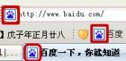

# 一些面试题目
## Browser加载Url过程
```js
    /*
        1、beforeunload事件：window、document以及资源卸载时触发
        2、pagehide事件：window，当浏览器在显示与会话历史记录不同的页面的过程中隐藏当前页面时, pagehide(页面隐藏)事件会被发送到一个Window
        3、visibilitychange事件：document，document.visibilityState(visibility,hidden,prerender)
        4、webkitvisibilitychange事件：
        5、unload事件：当文档或一个子资源正在被卸载时, 触发 unload事件
        绿线：Frame Started Loading
        Request Resource
            Request
            Receive
            Finish
        Parse Html
            parse
            request resource
            parse
            request resource
            ...
        6、readystatechange事件：document，document.readyState（loading、interactive，complete）
        7、DOMContentLoaded事件：document，页面DOM加载完成就触发，无需等待依赖资源的加载
        蓝线：DOMContentLoaded Event
        8、readystatechange事件：document，document.readyState（loading、interactive，complete）
        9、load事件：整个页面和依赖资源完成加载时，将触发load事件
        红线：load事件
        10、pageshow事件：当一条会话历史记录被执行的时候将会触发页面显示(pageshow)事件，这包括了后退/前进按钮操作，同时也会在onload 事件触发后初始化页面时触发
    */ 
```
## Javascript
### 执行环境（环境）与作用域
* `执行环境（ExecutionContext）`：定义了变量或函数有权访问的其他数据，决定了他们各自的行为。每个执行环境都有一个与之关联的变量对象(variable object，VO)，执行环境中定义的所有变量和函数都保存在这个对象中
* `全局执行环境（）：`是最外围的一个执行环境，包含所有全局的变量和函数，因宿主实现不同而不同。全局执行环境直到应用退出才会被销毁。
* `函数执行环境：`每一个函数都有自己的执行环境。当执行流进入一个函数时，函数的环境就会被推进一个环境栈中 ，执行结束，推出。
* `作用域链：`作用域链的用途是保证对执行环境有权访问的所有变量和函数的  有序访问 。
* `原型链：`用于继承属性和方法
```js
    /*
        执行过程：
            当代码在一个环境中执行时，会创建变量对象（VO）的一个作用域链(scope chain)。作用域链的前端，始终都是指向当前执行代码所在环境的变量对象（VO）。如果这个环境是函数，则将其活动对象（Activation Object，AO）作为变量对象（VO）。活动对象最初只包含了一个变量arguments。作用域链的下一个VO来自于包含环境，依次类推，一直延续到全局执行环境。
        标识符就是沿着作用域链一级一级往上查找，知道全局作用域。
                    global VO
                fna-VO          fnb-VO
                fna1-VO      fnb1-VO fnb2-VO
                fna2-VO                 fnb3-VO
        作用域链：
            gVO-fna-fna1-fna2
            gVO-fnb-fnb1
            gVO-fnb-fnb2-fnb3
    */
```
* `作用域链延长`
```js
/*
    try-catch语句中的catch语句，可以访问
    with语句，
*/ 
```
* `eval()执行环境：`
### JS语言重点特性
* `1、关于闭包`
```js
// 问题：
//      什么是闭包？闭包是指有权访问另一个函数作用域中的变量的函数。
//      闭包常见创建方式？在一个函数内部创建另一个函数。
// demo1
    function log(total) {
        var arr = []
        while (total > 0) {
            arr.push(function () {
                console.log(total)
            })
            total--
        }

        return arr
    }
    var a = log(5)
    let length = a.length
    while (length--) {
        a[length]() // 0，0，0，0，0
    }
// demo2
function log(total) {
        var arr = []
        while (total > 0) {
            total--
            var tmp = total
            arr.push(function () {
                console.log(tmp)
            })
        }

        return arr
    }
    const a = log(5)
    let length = a.length
    while (length--) {
        a[length]() // 0，0，0，0，0
    }
    // demo3
    function log(total) {
        var arr = []
        while (total > 0) {
            total--
            arr.push(function () {
                var tmp = total
                console.log(tmp)
            })
        }

        return arr
    }
    const a = log(5)
    let length = a.length
    while (length--) {
        a[length]() // 4，3，2，1，0
    }
```
* `es6的extends`
```js
    /*
        Javascript继承之extends
        ES6引入了关键字extends，用于实现class继承，但其本质仍然是构造函数和原型链
        extends之继承：
            1、子类Sub会继承超类Sup的 实例 共享方法，即原型继承
            2、子类Sub会继承超类的私有属性，非共享，实例独享，通过借用构造函数方法
                super(this)的本质就是借用构造函数，调用Sup的构造函数在子类中实例化：Sup.constructor.call(this)，可以传参数
            3、静态方法的继承：
                Sub子类会继承Sup类的static方法，且能通过Sub.staticXXXX直接调用
            4、如果子类没有写constructor，系统有一个默认的constructor且调用super(this)
            5、super只能在子类Sub的构造函数中使用，实例化对象；且必须在使用this之前调用super
    */ 
```
### Javacript apis
```js
    /*
        标准内置对象：
            Null
            Undefined
            Boolean
            String
            Number
            Object
            Map
            WeakMap
            Set
            WeakSet
            Promise
            RegExp
            Proxy
            Reflect
            Function
            Array
            Date
            Error
            JSON
            Math
            ...
    */ 
```
### JS浮点数计算精度丢失问题(https://2ality.com/2012/04/number-encoding.html)
```js
    /*
        digits：指0-9任意的一个数字
        exponent：指数，之处小数点左边（负指数）或右边（正指数）有几个digits
                指数部分是11位，0-2047.为了支持负数，
                规定1023是0，即base = 1023
                小于1023是负数 curr - base
                大于1023是正数 curr - bse
                指数p = e-1023
                但有两个指数位是保留的，0和2047。指数2047表示无穷大或NaN；指数0表示数字0或者无穷小
        significand(有效数字)：包含digits，exponent
        significand = 1.f * 2^p = 1.f * 2^(e-1023)

        非负浮点数的表示：有效数字包括符号位、指数位和小数位
        表示整数：最大整数可以超出2^53，是因为整数52位，可以借指数位表示大整数。但是，IEEE754规定了只能解析52位，所以当借指数位时，小数位的部分需要补0，故超出2^53的整数表示不是依次递增1

        机械极小值（machine epsilon）
        s：符号位
        f：小数位（尾数位）
        e：指数位
        (-1)^s * %1.f * 2^(e-1023)    0 < e  < 2047
        (-1)^s * %0.f * 2^(e-1022)    e=0, f>0
        (-1)^s * 0                    e=0,f=0
        NaN                           e=2047, f>0
        (-1)^s*inifinity              e=2047, f=0
        Demos：
            f=%101,p=2    ===>    %1.101*2^2=%110.1
            f=%101,p=-2   ===>    %1.101*2^-2=%0.01101
            f=%0,p=0      ===>    %1.0*2^0 = %1

        JS采用IEEE754标准存储浮点数，即1位符号位，11位指数位，52位尾数位
        十进制数的存储：
        整数部分转化成二进制：
            通过除以2取余数方法，例如2转化成二进制就是：00 0010
        小数部分转化成二进制：
            通过乘以2取整方法，例如0.1转化成二进制：
                0.1*2 = 0.2，整数0
                0.2*2=0.4，整数0
                0.4*2=0.8，整数0
                0.8*2=1.6，整数1
                0.6*2=1.2，整数0
                0.2*2=0.4，整数0，开始循环，计算机只用64位存储浮点数，不得不舍弃部分精度(0舍1入)，故产生精度丢失问题

        解决方案：获取浮点数小数位，变成整数进行计算，再转化成小数。要注意整数的溢出问题

        0.1 + 0.2，0.1和0.2都无法精确存储，导致计算结果不准确
        0.55无法精确存储，导致计算结果不准确
    */ 
```
### JS模块化（commonjs和es module）
* `commonjs：`
* `es module：`
### 浏览器同源策略：安全策略，用于限制一个origin的文档或脚本如何与另一个源的资源进行交互
```js
    /*
        遵循同源策略的webapi：
            localstorage，以源进行分割，每个源有自己单独的存储空间，一个源中的js脚本只能访问自己源内的数据
            sessionstorage，同localstorage
            cookie，同localstorage，但可以为本域和父域设置cookie【domain，path，secure，httponly，expires，max-age】
            IndexDB，同localstorage
            DOM操作
            Ajax受同源策略限制，不允许跨域请求（但可以协商配置，允许跨源请求）
        不遵循同源策略：
            script标签（link标签，img标签，video标签，@font-face，iframe（可以通过修改document.domain共享）cookie或者处理iframe）
            websocket

        跨源通信方案：
            1、JSONP方式，通过script等内嵌替换标签的src属性，服务器返回JS代码，实现跨源
            2、主域相同子域不同，document.domain和iframe解决跨域共享cookie，进行通信
            3、location.hash（hashchange）和iframe，解决跨域通信问题
            4、window.name同一窗口的所有页面共享读写权限，通过修改该值实现跨域通信
            5、window.postMessage和message事件，跨文档通信API，允许跨窗口通信，不论是否同源
                本质上，window.postMessage(message, targetOrigin)是一个跨域无服务器垫片的ajax请求
            6、通过websocket进行跨域通信，websocket  不受同源策略限制
            7、CORS，是HTTP的一部分，它允许服务端指定哪些主机可以从这个服务端加载资源
    */ 
```
### web apis(宿主环境提供的apis)
* `两个tab页(tab和内嵌iframe)之间的交互方式`
```js
    /*
        跨源tab通信方案：
            document.domain和iframe跨源通信
            location.hash(hashchange)和iframe跨源通信
            websocket进行跨源通信
            window.name统一窗口跨源通信
            window.postMessage和message事件
    */
    /*
        同源tab通信方案：
            localstorage、sessionstorage、IndexDB、cookie
            包括跨源tab通信方案
    */  
```
* `window、document`等实例
* `canvas apis：可以用于动画、游戏、数据可视化、图片编辑以及实时视频处理等方面。主要是2D图形；WebGL绘制2D和3D`
```js
    /*
        栅格(canvas grid)：
        坐标空间（coordinate space）:
        路径：一系列点连成的线段

        canvas仅支持两种形式的图形绘制：矩形和路径
        canvas画布默认是300*150，可以通过canvas属性改变画布大小
        css样式样式设置canvas在屏幕的显示大小（似乎函数计算坐标以画布大小为准）

        HTMLCanvasElement（EventTarget <|-- Node <|-- Element <|-- HTMLElement <|-- HTMLCanvasElement）

        HTMLCanvasElement = {
            width： 画布宽度
            height：画布高度

            captureStream()， 捕捉画布实时视频
            getContext()，获取画布上下文（2D或3D），返回CanvasRenderingContext2D或WebGLRenderingContext
            toDataUrl()，返回数据URL，默认png，图像分辨率是96dpi
            toBlob()，创建一个Blob对象，表示canvas的图像
            transferControlToOffscreen()，将控制权转移到主线程或辅助线程上的offscreenCanvas对象

            事件
            webglcontextcreationonerror
            webglcontextlost
            webglcontextrestored
        }

        CanvasRenderingContext2D = {
            // 绘制矩形
            clearReact(x,y,width,height)
            fillReact(x,y,width,height)
            strokeReact(x,y,width,height)
            // 绘制文本
            fillText()
            strokeText()
            measureText()
            // 线型
            lineWidth()
            lineCap()
            lineJoin()
            miterLimit()
            getLineDash()
            setLineDash()
            lineDashOffset()
            // 文本样式
            font:
            textAlign:
            textBaseline:
            direction:
            // 填充和描边
            fillStyle:
            strokeStyle:
            // 渐变和图案
            createLinearGradient()
            createRadialGradient()
            createPattern()：使用指定的图片创建图案
            // 阴影
            shadowBlur:
            shadowColor:
            shadowOffsetX:
            shadowOffsetY:
            // 路径
            beginPath()
            closePath()
            moveTo(x, y)
            lineTo(x, y)
            bezierCurveTo()，3次贝塞尔曲线路径
            quadraticCurveTo()，2次贝塞尔曲线路径
                // 画一个以(x,y)为圆心,radius为半径的圆弧，从startAngle角度到endAngle，anticlockwise方向
            arc(x, y, radius, startAngle, endAngle, anticlockwise)
                // 以控制点和半径画圆弧，再连接控制点
            arcTo(x1, y1, x2, y2, radius)
            ellipse()
            rect()
            // 绘制路径
            fill()
            stroke()
            drawFocusIfNeeded()
            scrollPathIntoView()
            clip()
            isPointInPath()
            isPointStroke()
            // 变换
            currentTransform:
            ratate()
            scale()
            translate()
            transform()
            setTransform()
            resetTransform()
            // 合成
            globalAlpha:
            globalCompositeOperation:
            // 绘制图像
            drawImage()
            // 像素控制
            createImageData()
            getImageData()
            putImageData()
            // 图像平滑
            imageSmoothingEnabled()
            // canvas状态
            save:
            restore:
            canvas:
            // 点击区域
            addHitRegion()
            removeHitRegion()
            clearHitRegion()
        }
        WebGLRenderingContext
    */ 
```
* `WebGL API：`
* `DOM`
```js
    /*
        关于CSS样式
            1、style标签：内联样式（还包括style属性），文档的样式信息或部分内容 <style type="text/css"></style>
            2、link标签和@import(需要卸载style标签内)：外联样式，<link rel="stylesheet" type="text/css" href="*.css"></link>
            2、document.styleSheets：
            3、element.style属性和element.style.cssText
    */
```
* `CSSOM：内联样式（标签style），嵌入样式（head style），外部样式（head link），优先级依次降低`
```js
// CSS选择器解析顺序从右向左（树结构，从左向右会损失性能）
/*
    BFC(Block Format context)：块级格式化上下文，一个独立的渲染区域。
        重点：和是否块级元素或内联元素无关，display可以修改
    创建BFC：
        float的值不是none
        position的值不是static或relative
        display的值不是inline-block，table-cell，flex，table-caption，inline-flex
        overflow的值不是visible
        父元素与正常文件流的子元素（非浮动元素）自动形成一个BFC
    CSS选择器中的伪类和伪元素
        伪类选择器：CSS选择器的一种，用于选择 处于特定状态 的元素，表现形式就是开头是冒号的关键字，:key-words
            :last-child
            :only-child
            :invalid
            用户行为伪类(动态伪类)
            :active
            :hover
            :focus
            :focus-visible
            :focus-within
            :any-link
            :checked
            :current
            :default
            :dir
            :empty
            :enabled
            :first
            :first-child
            :first-of-type
            :future
            :left
            :link
        伪元素选择器：开头为双冒号的关键字，::key-words，也支持单冒号写法
            ::first-line
            ::first-letter
            ::selection
            ::soelling-error
            ::grammar-error
            ::before
            ::after

*/

    /*
CSS Selectors
    1、type selector
    2、universal selector   ----> *
    3、attribute selector   ----> []
    4、class selector       ----> .
    5、ID selector          ----> #
    6、pesudo(假的)-class    ---->
        6-1：:lang
        6-2：:nth-child()
        6-3：:nth-last-child()
        6-4：:nth-of-type()
        6-5：:nth-last-of-type()
        6-5：:not()
    6、pesudo-class         ---->
    6、pesudo-class         ---->
6、CSS
---------------6-1、CSS样式表（CSS Style Sheets，DOM接口CSSStyleSheet）---------------    
    6-1、CSS Style Sheets：代表style sheet的抽象概念，对应DOM接口CSSStyleSheet，
        StyleSheet（StyleSheetList）：抽象的基础的样式表
        StyleSheet = {
            type：CSSOMString，"text/css"
            href：USVString，内联样式返回null；外部样式返回绝对地址
            ownerNode：Element，null或与之关联的DOM节点
            parentStyleSheet：CSSStyleSheet，
            title：DOMString，
            media：MediaList，
            disabled：boolean，
        }
    重点：CSSStyleSheet = {
            ownerRule：CSSRule，null 或 关联的样式规则（选择器和css声明块）
            cssRules：CSSRuleList，CSS样式表关联的css规则

            long insertRule(CSSOMString rule, long index)
            undefined deleteRule(long index)
        }
---------------6-2、CSS Style Sheet Collections-----------------------------------
    6-2、CSS Style Sheet Collections：每一个文档都会关联0或多个CSS Style sheets
        StyleSheetList：CSSStyleSheet的有序集合，
        StyleSheetList = {
            length：long，集合中的样式表总数

            CSSStyleSheet item(long index)，返回集合中的样式表（CSS style sheet）
        }

        DOM结构：
            document.styleSheets，返回StyleSheetList实例
---------------6-3、Fetching CSS Style Sheets-----------------------------------
    6-3、Fetching CSS Style Sheets
        interface mixin LinkStyle {
            CSSStyleSheet sheet
        }
        link标签实例含有属性sheet
 ---------------6-4、CSS Rules-----------------------------------   
    6-4、CSS Rules：就是实现了CSSRule接口，并含有选择器和声明块，对应DOM接口CSSStyleRule
        CSSRule（CSSRuleList）：基础类
            CSSRule = {
                cssText：CSSOMString，可修改，CSSRule的字符串表示
                parentRule：CSSRule | null，父样式规则
                parentStyleSheet：CSSStyleSheet | null，父样式表引用
                type：short，常量值，创建CSSRule时初始化
            }
    重点：CSSStyleRule：CSSRule的派生类，即CSS rules
            CSSStyleRule = {
                selectorText：CSSOMString ，选择器字符串表示
                style：CSSStyleDeclaration，CSS声明语句块（花括号内容）
            }
    重点：CSSImportRule：CSSRule的派生类，
            CSSImportRule = {
                href: USVString
                media: MediaList
                styleSheet: CSSStyleSheet
            }
    重点：CSSGroupingRule：CSSRule的派生类，at-rule
            CSSMediaRule = {
                cssRules: CSSRuleList
                long insertRule(CSSOMString rule, long index)
                undefined deleteRule(long index)
            }
    重点：CSSMediaRule：CSSRule的派生类，
            CSSMediaRule = {

            }
    重点：CSSFontFaceRule：CSSRule的派生类，
            CSSFontFaceRule = {

            }
    重点：CSSPageRule：CSSRule的派生类，
            CSSPageRule = {
                selectorText: CSSOMString
            }
    重点：CSSNamespaceRule：CSSRule的派生类，
            CSSNamespaceRule = {
                namespaceURI: CSSOMString
                prefix: CSSOMString
            }
    重点：CSSKeyFramesRule：CSSRule的派生类，
            CSSKeyFramesRule = {

            }
    重点：CSSKeyFrameRule：CSSRule的派生类，
            CSSPageRule = {

            }
    6-4-1、CSSRuleList是CSSStyleRules的有序集合
        CSSRuleList = {
            getter CSSRule item(long index)
            long length
        }
-------------6-5、CSS声明（CSS Declaration，无DOM接口）-----------------------------
        6-5、CSS Declaration：CSS声明是一个抽象概念，没有在DOM中开放接口
            CSS Declaration = {
                name: 声明的属性名
                value: 对应值
                importantFlag：import标识
                case-sensitive-flag：大小写标识
            }
            Demos: 
                background: red !important;
------------6-6、CSS声明块（CSS Declarations，DOM接口CSSStyleDeclaration）---------------
        6-6、CSS Declaration Blocks（CSS Declarations）：CSS Declaration的有序集合，
            在DOM中开放了接口CSSStyleDeclaration，
            CSSStyleDeclaration = {
                cssText：CSSOMString，空字符串或者序列化后的css declarations
                length：long，返回css declaration的个数
                parentRule: 
                cssFloat:
                camel-cased:

                item：（long） => CSSOMString，根据索引获取属性
                getPropertyValue(property)：根据属性获取属性值
                getPropertyPriority(property)：获取元素优先级["", "important"]
                setProperty(property, value, priority)
                removeProperty(peoperty)
            }
            Demos：
                {
                    background: red;
                    width: 100px;
                    height: 100px;
                }
-------------6-7、CSS Values-------------------------------------------
-------------7、DOM Access to CSS Declaration Blocks-------------------
    7-1、ElementCSSInlineStyle
        元素style属性返回CSSStyleDeclaration，且computedFlag是unset，parent CSS rule
        是null，owner node就是当前element
    7-2、window.getComputedStyle(element, CSSOMString pseudoElt)
        返回CSSStyleDeclaration，且computedFlag是set，parent CSS rule是null，owner node是obj
    7-3、document.styleSheets访问

    对比：
        element.style：读取的是元素的内联样式，即style属性上的值；该值可读可写
        getComputedStyle：读取的是最终样式，包括内联样式、嵌入样式和外部样式；返回值只读
--------------------------------------------------------------------

    */ 
    /*
        JS操作css几种方式：
            1、通过style标签生成样式
                var style = document.createElement("style")
                style.type = "text/css"
                style.appendChild(document.createTextNode(newStyle))
                document.head.appendChild(style)
            2、通过link标签添加样式
                var link = document.createElement("link")
                link.type = "text/css"
                link.rel="stylesheet"
                link.href=""
                document.head.appendChild(link)
            3、修改元素style属性(类型是CSSStyleDeclaration和CSSStyleSheet, CSSStyleRule中的style属性是CSStyleDeclaration,CSSRule不一样)
                element.style.height = ""
                element.setAttribute("height", XXX)
                element.setAttribute("style", XXX)
                element.setProperty("height", XXX)
            4、修改元素className属性
                element.className=""
            5、修改文档的document.styleSheets属性（link和style实例也可以返回样式表link.sheet,style.sheet）
                修改style.cssText
                document.styleSheets[0].cssRules.cssText = "height: 100px;width: 100px;"
                document.styleSheets[0].addRule(".box", "height: 100px")
                document.styleSheets[0].insertRule(".box", "height: 100px", 0)

                StyleSheet对象是文档中链接或嵌入的样式表，包括link的外部样式表和style的内部样式表,样式表是由CSS规则组成，可以通过CSSRule操作每一条规则
                StyleSheet = {
                    media: 【screen、print】，默认screen，
                    disabled：打开或关闭一张样式表
                    href：返回StyleSheet对象链接的样式表地址，内联，值为null
                    title：StyleSheet对象的title值
                    type：通常是text/css
                    parentStyleSheet：CSS允许@import，该属性反悔了包括当前样式表的那张样式表（父样式表）
                    ownerNode：通常是link或style
                    cssRules：类数组对象，CSS规则，
                        cssRules[0].cssText，是对应的CSS规则字符串形式: sheet.cssRules[0] ====> "p {color: black;}"
                        cssRules[0].style.color = "red"，用来读写具体的CSS命令
                    insertRule: function() {}：插入函数
                    deleteRule: funciton(){}：删除函数
                }


                document.styleSheets只读属性，是一个StyleSheetList
    */ 
```
* `Fetch API`
* `HTML Drag and Drop API`
* `IndexedDB`
* `Intersection Observer API`
* `Storage`
* `Streams`
* `TouchEvents`
* `URL API`
* `Web Animations API`
* `Web Storage API`
* `Web Workers API`
* `WebGL`
* `WebRTC`
* `WebVR API`
* `WebVTT`
* `WebSockets API`
### chrome devtools(调试工具)
* `代理工具：`charles等
* `chrome remote debug：`
## CSS
## html
### meta标签：元数据元数，表示不能由其他元素表示任何元素局信息
```js
    /*
        <meta name="" content="" />：文档级别的元数据
        <meta http-equiv />：编译指令，与类似命名的http头部相同
        <meta charset="utf-8" />：字符集声明
        <meta itemprop />提供了用户定义的元数据

        charset：声明了文档的字符编码。必须是与ASCII大小写无关的"utf-8"
        content：包含了http-equiv或name的值
        http-equiv：定义了一个编译指示命令，取值都是http的头
        name：和content一起使用，提供元数据
        使用场景：
            <meta charset="utf-8" />
            <meta name="viewport" content="width=device-width,initial-scale=1,minimum-scale=1,maximum-scale=1,user-scalable=no" />
            <meta name="theme-color" content="#000000" />
    */ 
```
### base标签：指定root url
```js
    /*
        <base href="" target=""/>
            href： root url
            target：【_blank，_self，_parent，_top】
        可以通过document.baseURI访问root url，默认是document.location.href
    */ 
```
### script标签：
### style标签：
```js
    /*
        <style type="text/css" media="all">
        </style>
    */ 
```
### title标签：定义文档的标题，显示在浏览器的标题栏或标签页上
### link标签：外部资源链接元素，规定了当前文档和外部资源的关系
```js
    /*
        link常用场景：
            1、链接外部样式表
            2、创建站点图标：PC站的favicon（favorite icon缩写，又称为website icon，page icon，url icon）图标和移动设备上显示在屏幕上的图标
            href属性：指定外部资源路径
            sizes：图标大小
            type：链接自愿的MIME类型
            media：媒体查询条件
            rel：relationship，【stylesheet、icon、apple-touch-icon-precomposed、preload】
            as：配合rel=preload使用
            crossorigin：【anonymous， use-credentials】
            disabled：配合rel=stylesheet使用
            hreflang：语言
            importance：【auto、high、low】
            integrity：
            referrerpolicy：指定引荐来源网址
            title：

            methods：
            prefetch：
            target：
            使用场景：
                <link rel="shortcut icon" href="%PUBLIC_URL%/favicon.ico" />
                <link rel="manifest" href="%PUBLIC_URL%/manifest.json" />
    */ 
```

### iframe标签（https://www.cnblogs.com/hq233/p/9849939.html）
```js
    /*
        iframe标签：
            frameborder：是否显示边框
            height：高度
            width：宽度
            name：名字，window.frames[name]可以访问
            scrolling：是否可滚动
            src：资源schema
            srcdoc：代替html中body的内容
            sandbox：对iframe进行一些限制

            页面嵌入同源iframe，可以互相访问，互相操作DOM
            页面可以
                通过iframe.contentWindow获取window对象（dom节点提供的api）
                通过iframe.contentDocument获取document对象（dom节点提供的api）
            iframe可以通过
                window.parent获取上一级window对象
                window.top获取顶级容器window对象
                window.self获取window自身引用

        iframe妙用：
            1、http长轮询（iframe实现长轮询）（iframe做轮询，异步发送请求使用iframe实现，可以不跳转页面）
                http长轮询是，server收到请求后，有数据立即响应请求；没有数据，就会等待数据处理，超时，就以空数据形式响应请求；需要服务端配合实现方案
                浏览器收到数据为空，会再次发送同样的http请求到server
                缺点：造成服务器资源浪费
            2、http短轮询是，sever收到请求后，不管是否有数据，server立即响应请求；
                浏览器收到空数据，隔一段时间发送相同的http请求到server
            3、websokcet：客户端与服务端建立的持久化链接
    */ 
//    iframe长轮询
    var iframeCon = document.querySelector("#container")
    var text = ""
    var iframe = document.createElement("iframe")
    iframe.id = "frame"
    iframe.style = "display: none;"
    iframe.name = "polling"
    iframe.src = "target.html"
    iframeCon.appendChild(iframe)
    iframe.onload = function() {
        var iloc = iframe.contentWindow.location
        var idoc = iframe.contentDocument
        setTimeout(function(){
            text = idoc.getElementByTagName("body")[0].textContent
            console.log("text===>", text)
            iloc.reload(); // 刷新页面，再次获取信息，并且会触发onload
        }, 2000)
    }
// 广告应用iframe
// 防止被iframe
if (window !== window.top) {
    window.top.location.href = "correctUrl"
}
// X-Frame-Options：http头【DENY，SAMEORIGIN，ALLOW-FROM】
// sanbox：不能使用locastorage、cookie；不能发送script请求；不能发送ajax请求；不能发送表单；不能创建新弹窗和window
```
## React技术栈
## React生命周期
```js
    /*
        class(旧版)：
        constructor(props, context// 默认空对象)
        componentWillMount()    // 无参数
        render()                // 无参数
        componentDidMount()     // 无参数

        componentWillReceiveProps(nextProps, context)
        shouldComponentUpdate(nextProps, nextState, nextContext)
        componentWillUpdate(nextProps, nextState, nextContext)
        render()
        componentDidUpdate(prevProps, prevState, snapShot)

        componentDidCatch(error, errorInfo)
        componentWillUnmount() // 无参数
        -----------------------------
        class(新版):
        constructor(props, context)
        static getDerivedStateFromProps(nextProps, prevState)
        render()
        componentDidMount() // 无参数

        static getDerivedStateFromProps(props, state)
        shouldComponentUpdate(nextProps, nextState, nextContext)
        render()
        getSnapshotBeforeUpdate(prevProps, prevState) // 返回值是DidUpdate的snapshot参数值
        componentDidUpdate(prevProps, prevState, snapshot)

        static getDerivedStateFromError(nextProps, prevState)
        componentWillUnmount() // 无参数

    */ 
```
## webpack
## nodejs
## 数据结构